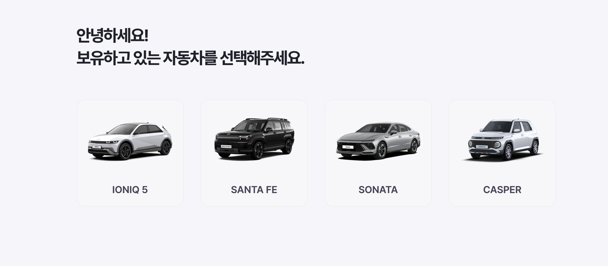
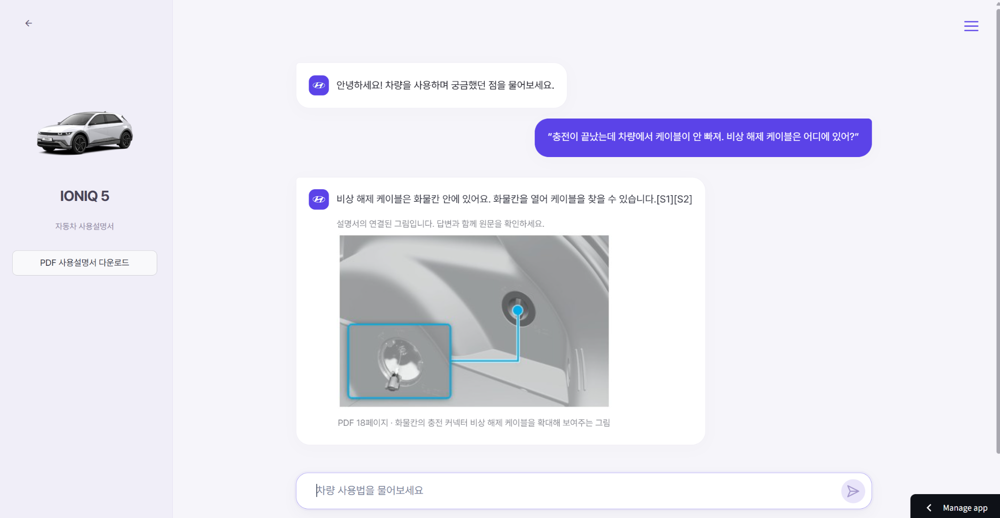
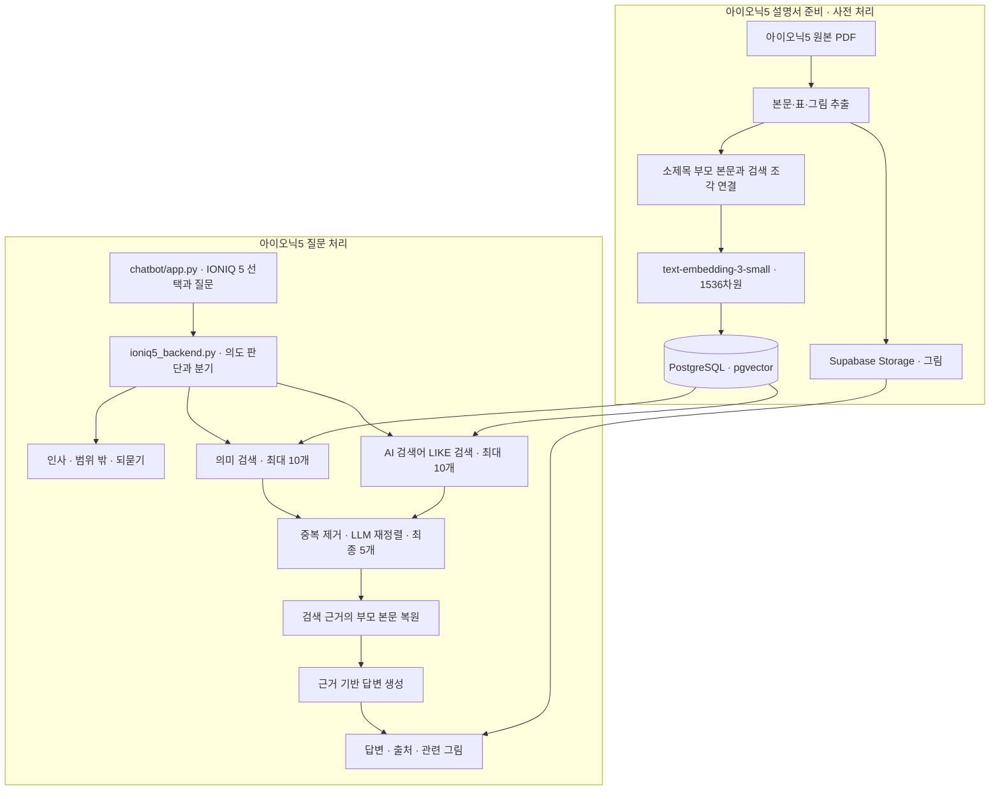
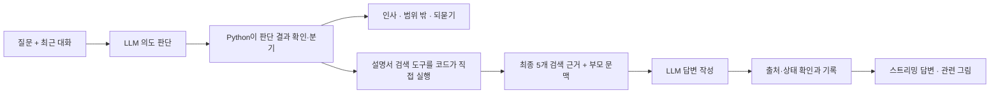

# CAR MANUAL RAG · TEAM 1

**아이오닉5 사용설명서에서 질문에 맞는 근거를 검색해, 차량 사용자가 답변과 원문 출처·관련 그림을 확인할 수 있는 Streamlit RAG 챗봇입니다.**

[배포 앱 열기](https://ioniq5-manual-chatbot.streamlit.app/) · [발표자료](https://docs.google.com/presentation/d/15OdM3TzVqLWsYluCUW0WKaDsuQUP3oldpX9MQz1O2iM/edit)

팀은 아이오닉5·싼타페·쏘나타·캐스퍼를 각자 구현하고 공통 화면에 연결했습니다. **이 README의 데이터·아키텍처·기능·평가·시연은 첨부 PPT의 발표 기준인 아이오닉5를 중심으로 설명합니다.** 팀원별 구현은 협업 과정과 담당 영역에 정리했습니다. 아래 내용은 2026-10-08 저장소 코드와 기록 기준입니다.

## 1. 프로젝트 소개

- **문제:** 긴 자동차 설명서에서 원하는 기능의 조작 순서·조건·주의사항을 찾기 어렵고, 사용자의 일상 표현과 설명서 용어가 다를 수 있습니다.
- **해결:** 아이오닉5 설명서에서 질문의 의미와 검색어에 맞는 근거를 찾고, 후보를 재정렬해 답변과 원문 출처·관련 그림을 제공합니다. 공통 앱의 문서·대시보드에서 데이터와 평가 기록을 확인합니다.
- **기간 / 팀:** 2026.10.02~2026.10.07(휴일제외 3일)/ 4명. 팀원별 공통 작업과 추가 담당 영역은 10번에 정리했습니다.

### 팀의 진행 과정

1. **차종별 독립 구현:** 아이오닉5·쏘나타·싼타페·캐스퍼의 공식 PDF를 확보하고, 각자 문서 처리·검색·답변 생성 방식을 구현했습니다.
2. **비교 기준 마련:** 질문의 종류에 따라 검색 결과가 달라질 수 있어, 아이오닉5 질문·자료를 고정한 A/B/C 평가셋으로 검색 방식을 비교했습니다.
3. **검색 개선:** 의미 검색 → TF-IDF와 의미 검색의 RRF 결합 → AI 검색어와 의미 검색·LLM 재정렬의 세 구성을 비교했습니다.
4. **공통 화면 연결:** 평가 범위에서 결과가 좋았던 3차 검색 구성을 아이오닉5 백엔드에 연결하고, 의도 판단·되묻기·출처 표시와 함께 시연합니다.

PDF의 큰 목차 체계가 유사하다는 점을 활용했지만, 차종별 표·그림·소제목 구조나 RAG 구현이 모두 같다고 가정하지 않았습니다. 발표는 **주제 선정 → 협업 → 골든셋 → 검색 개선 → 질문 의도·답변 처리 → 아이오닉5 시연** 순서입니다.

## 2. 데모

차종 선택 화면에서 **IONIQ 5**를 선택한 뒤 질문합니다. 아래는 공통 앱의 선택 화면과 첨부 PPT 27쪽의 아이오닉5 답변 화면입니다. 현재 배포 버전의 전체 기능을 새로 검증한 결과와는 구분합니다.





**발표 시연 순서:** IONIQ 5 선택 → 상황 질문 입력 → 답변과 인용 번호 확인 → 연결된 그림·PDF 페이지 확인 → 원문 근거와 답변 대조. 첨부 PPT 27쪽의 예시는 “충전이 끝났는데 차량에서 케이블이 안 빠져. 비상 해제 케이블은 어디에 있어?”입니다. 이 화면은 한 사례의 표시 예시이며 답변 품질 전체를 증명하지 않습니다.

## 3. 주요 기능

- **상황 질문:** 아이오닉5를 선택하고 충전·차량 기능·사용법 관련 질문을 일상 표현으로 입력합니다.
- **의도 확인과 후속 대화:** 이전 대화를 참고해 설명서 검색이 필요한지 판단하고, 질문이 모호하면 추가 정보를 요청합니다.
- **근거 기반 답변:** 검색한 설명서 문맥을 바탕으로 답변을 읽고 인용 번호·PDF 페이지·원문을 확인합니다.
- **관련 그림:** 인용한 근거에 연결된 그림을 보고 부품 위치와 조작 설명을 함께 확인합니다.
- **평가 기록 확인:** 공통 앱의 문서·대시보드에서 아이오닉5 검색 비교 결과와 작업 기록을 확인합니다.

## 4. 아키텍처



### 아이오닉5의 현재 검색 구성

1. **의미 검색:** 질문과 문서의 의미를 `text-embedding-3-small`의 1536차원 벡터로 비교해 최대 10개를 찾습니다.
2. **검색어 기반 검색:** AI가 질문에서 구문 최대 2개·단어 최대 4개를 뽑고, 문서에 해당 표현이 포함되는지 LIKE 검색으로 최대 10개를 찾습니다.
3. **재정렬:** 두 검색 결과의 중복을 제거한 후보를 `gpt-5.6-luna`가 질문과의 관련성에 따라 정렬하고 최종 5개를 선택합니다.
4. **문맥 복원:** 검색 조각에 연결된 소제목 단위의 부모 본문을 불러와 답변에 필요한 주변 설명을 제공합니다.
5. **답변과 출처:** `gpt-6-luna`가 근거를 바탕으로 답변을 작성하고, 인용한 자료의 출처와 연결된 그림을 표시합니다.

이 구성은 PPT의 3차 검색 개선에 대응합니다. 2차 TF-IDF·RRF는 비교 실험이며 현재 기본 검색 경로와 구분합니다. 코드 근거: [아이오닉5 백엔드](src/car_search_rag/anna_rag/chatbot/ioniq5_backend.py).

### 아이오닉5의 질문 이해와 답변 작성

첨부 PPT 22쪽과 현재 `ioniq5_backend.py` 기준입니다. 같은 세션의 이전 대화는 최대 6쌍, 합계 4000토큰 이내의 완전한 쌍을 선택해 의도 판단에 전달합니다.



현재 아이오닉5는 검색 도구 선택을 위해 LLM을 한 번 더 호출하는 단계를 생략합니다. LLM이 의도를 판단하면 코드가 검색을 실행합니다. 쏘나타의 Agent 도구 호출 구조와 구분합니다. 쉬운 표현으로 답변하되 조작 조건·금지사항·경고를 유지하도록 지침을 두었습니다. “충전 인렛”을 “차량 충전구”로 풀어 쓰는 것은 문체 예시이며 실제 응답 성공률 측정값은 아닙니다.

## 5. 기술 스택

| 역할 | 기술·선언 버전 | 사용 목적 |
|---|---|---|
| 언어 | Python `>=3.12` | 전처리·검색·웹 앱 |
| 화면 | Streamlit `>=1.65.0` | 공통 UI·문서·대시보드 |
| RAG·Agent | LangChain `>=1.4.3`, langchain-openai `>=1.6.6` | 모델·검색 도구 연결 |
| PDF | PyMuPDF `>=1.28.2`, pypdf `>=6.19.0` | 본문·그림 추출 |
| 단어 검색 | scikit-learn `==1.9.1`, Kiwi `==0.23.2` | TF-IDF·일부 비교 실험의 명사 추출 |
| 저장·접속 | PostgreSQL·pgvector, psycopg `>=3.3.6`, supabase `>=2.31.0` | 본문·벡터·그림 저장 |
| 임베딩 | OpenAI `text-embedding-3-small` · 1536차원 | 아이오닉5 질문·문서의 의미 비교 |
| 재정렬 모델 | OpenAI `gpt-5.6-luna` | 후보 관련성 판단과 순위 조정 |
| 의도·답변 모델 | OpenAI `gpt-6-luna` | 질문 의도 판단·검색어 추출·근거 기반 답변 |

위 버전은 루트 [pyproject.toml](pyproject.toml)의 선언 범위입니다. 잠금 버전은 [uv.lock](uv.lock), 배포용 고정 의존성은 [chatbot/requirements.txt](src/car_search_rag/anna_rag/chatbot/requirements.txt)를 확인합니다.

## 6. 데이터와 전처리

발표·평가 대상은 **아이오닉5 국문 사용설명서 `NE1_2027_ko_KR`**입니다. 원본은 [현대자동차 사용설명서](https://ownersmanual.hyundai.com/)에서 해당 차종·연식 자료를 확보합니다.

| 자료 | 처리 규모 | 상세 근거 |
|---|---|---|
| 아이오닉5 `NE1_2027_ko_KR` | 비교 실험 당시 검색 조각 2338개·부모 본문 552개 | [비교 설정](src/car_search_rag/anna_rag/evaluation/santafe_transfer_abc_v1/config.json) |

규모는 비교 실험의 측정 시점 기준이며 DB의 현재 건수를 다시 센 결과는 아닙니다. 아래는 저장 자료를 이해하기 위한 주요 항목의 개념과 자료형 예시입니다.

| 항목 | 자료형 예시 | 의미 |
|---|---|---|
| 청크 ID | 문자열/정수 | 검색 조각을 구분하는 고유 번호 |
| 본문·제목 | 문자열 | 검색 내용과 소제목 |
| 차량/문서 ID | 문자열/정수 | 다른 차량·설명서 버전과 구분 |
| PDF 페이지 | 정수/정수 배열 | 원본 근거 위치 |
| 임베딩 | 벡터 | 질문과 자료의 의미 비교 |
| 이미지 연결 | ID/연결 테이블 | 관련 그림·Storage 경로 참조 |

- **문서 분할:** 소제목 단위 본문을 부모 자료로 보존하고, 검색용 조각으로 나누어 연결합니다. 등록 노트북의 분할 설정은 400자·목표 겹침 80자입니다.
- **출처 연결:** 검색 조각·부모 본문에 PDF 페이지와 관련 그림을 연결해 답변에서 원문을 확인할 수 있도록 준비합니다.
- **일상 표현 처리:** 현재 검색은 AI가 질문에서 검색 구문·단어를 추출합니다. 답변 지침의 “충전 인렛 → 차량 충전구”는 쉬운 표현 예시이며, 저장 문서를 그 용어로 일괄 치환했다는 뜻은 아닙니다.

DB·Storage 자료는 clone만으로 복제되지 않습니다. 데이터 재구축은 [아이오닉5 등록 노트북](src/car_search_rag/anna_rag/3_전체_PDF_청킹_및_DB적재.ipynb)을 확인합니다. 결측·중복·이상치 처리 건수와 전체 수집 기간은 확인되지 않아 기재하지 않았습니다.

## 7. 실행 방법

### 준비

- Python 3.12 환경, Git, OpenAI API 키([발급처](https://platform.openai.com/api-keys)).
- 아이오닉5 설명서 자료가 적재된 PostgreSQL·Supabase DB/Storage와 접근 권한.

### 로컬 공통 앱 실행 · uv

[uv](https://docs.astral.sh/uv/)가 설치된 Python 3.12 환경에서 아래 순서로 실행합니다. DB와 Storage는 아래 환경 설정에 맞는 기존 적재 자료를 준비해야 합니다.

```powershell
git clone https://github.com/encore-ai-campus/mle-02-p1-team1.git
cd mle-02-p1-team1
uv sync --locked
Copy-Item .env.example .env
# .env를 열고 실제 API 키·DB·Storage 연결 정보를 입력합니다.
uv run streamlit run src/car_search_rag/anna_rag/chatbot/app.py
```

### 배포 의존성 기준 실행 · pip

```powershell
git clone https://github.com/encore-ai-campus/mle-02-p1-team1.git
cd mle-02-p1-team1
python -m venv .venv
.\.venv\Scripts\python.exe -m pip install -r src/car_search_rag/anna_rag/chatbot/requirements.txt
Copy-Item .env.example .env
# .env를 열고 실제 API 키·DB·Storage 연결 정보를 입력합니다.
.\.venv\Scripts\python.exe -m streamlit run src/car_search_rag/anna_rag/chatbot/app.py
```

`.env.example`에는 예시만 있습니다. `.env`와 `.streamlit/secrets.toml`은 커밋하지 않습니다. 새 환경에서 설치→DB 준비→질문 생성까지의 전체 실행은 이번 README 작성 중 수행하지 않았습니다. 외부 DB 권한 없이 명령어만으로 즉시 재현되는 프로젝트는 아닙니다.

### 환경 설정

| 변수 | 목적 |
|---|---|
| `OPENAI_API_KEY` | OpenAI 모델 인증 |
| `DB_URL` | 아이오닉5 설명서 PostgreSQL 연결 |
| `SUPABASE_URL`, `SUPABASE_SECRET_KEY` | 아이오닉5 관련 그림의 Storage 연결 |

앱을 실행한 뒤 **IONIQ 5**를 선택합니다. Streamlit Cloud 진입 파일은 `src/car_search_rag/anna_rag/chatbot/app.py`, 브랜치는 `main`입니다. Cloud Secrets에 연결 정보를 설정합니다. 상세는 [배포 안내](src/car_search_rag/anna_rag/chatbot/README.md)를 확인합니다. 다른 차종 실행에 필요한 별도 설정은 각 담당 폴더의 안내를 따릅니다.

## 8. 프로젝트 구조

```text
mle-02-p1-team1/
├── README.md / .env.example        # 팀 안내·설정 예시
├── pyproject.toml / uv.lock        # 개발 환경
├── app_kbj.py                     # 쏘나타 공통/개인 진입점
├── data/                          # 원본·로컬 자료(일부 Git 제외)
├── docs/images/                   # README 화면 캡처
└── src/car_search_rag/
    ├── anna_rag/
    │   ├── chatbot/app.py         # 공통 화면
    │   ├── chatbot/registry.py    # 차량별 백엔드 연결
    │   ├── chatbot/ioniq5_backend.py
    │   └── evaluation/            # 아이오닉5·검색 방식 이식 비교
    ├── car_search/                # 쏘나타 등록·검색·Agent·평가
    ├── casper_manual/             # 캐스퍼 RAG·SQL·산출물
    ├── zzong_santafe_lag/          # 싼타페 검색·원문 검토·보고서
    └── common/                    # DB·SQL·Storage 등 공유 기반
```

차량 연결: 아이오닉5 → `ioniq5_backend.py`, 쏘나타 → 루트 `app_kbj.py`, 캐스퍼 → `casper_manual/src/rag.py`, 싼타페 → `zzong_santafe_lag/app.py`의 `create_backend()`.

## 9. 검색 품질 평가

**Hit@5**는 정답 근거가 상위 5개 안에 있는 비율, **MRR@5**는 첫 정답 근거가 앞에 나올수록 높아지는 지표입니다. 검색 성공과 최종 답변 정확성은 별도로 평가합니다.

### 동일 아이오닉5 개발용 A/B/C 30문항 비교

A=상위 주제, B=한 기능의 구체 질문, C=여러 의미 맥락을 결합한 질문 각 10개입니다. 기존 20문항의 사람 검수 이력은 보존됐으나 신규 A10과 새 분류는 사람 검토가 남아 있습니다.

| 구성 | Hit@5 | MRR@5 |
|---|---:|---:|
| 의미 검색 | 23/30 (76.7%) | 0.6278 |
| 의미+TF-IDF RRF | 26/30 (86.7%) | 0.6700 |
| AI 검색어+의미 검색+LLM 재정렬 | 28/30 (93.3%) | 0.8667 |

**발표의 3단계 개선:** 1차 의미 검색 23/30 → 2차 RRF 26/30 → 3차 AI 검색어·LLM 재정렬 28/30. Hit@5는 76.7% → 86.7% → 93.3%, MRR@5는 0.6278 → 0.6700 → 0.8667입니다. 같은 개발용 평가 범위의 검색 개선이며 최종 답변 정답률이 아닙니다.

| 발표 단계 | 검색 후보·순위 결정 | 해결하려 한 문제 |
|---|---|---|
| 1차 의미 검색 | 질문과 청크를 같은 임베딩으로 표현, 코사인 유사도 상위 5개 | 질문의 의미에 가까운 근거 찾기 |
| 2차 TF-IDF + RRF | Kiwi로 2글자 이상 명사 추출, 단어·의미 검색 각 최대 50개 → 동일 가중 RRF → 5개 | 구체적 용어·조건을 포함한 후보 보완 |
| 3차 AI 검색어 + LLM 재정렬 | AI가 구문 최대 2개·단어 최대 4개 추출, 의미·LIKE 각 10개 → 중복 제거·재정렬 → 5개 | 다양한 표현의 후보 확보와 정답 근거의 앞순위 배치 |

2차 RRF는 `1/(60+단어 검색 순위) + 1/(60+의미 검색 순위)`입니다. 한쪽에 없는 청크는 해당 항을 0으로 계산합니다. 3차 LIKE 점수는 구문 일치 3점·단어 일치 1점이며, 재정렬 모델은 후보 본문 관련성을 판단해 순서만 바꿉니다. 재정렬 단계에서 최종 사용자 답변을 생성하지 않습니다.

### 질문 유형별 결과 · 각 10문항

| 유형 | 1차 Hit@5 / MRR@5 | 2차 Hit@5 / MRR@5 | 3차 Hit@5 / MRR@5 |
|---|---|---|---|
| A · 상위 목차 주제 | 100% / 1.0000 | 100% / 1.0000 | 100% / 1.0000 |
| B · 같은 기능의 구체 질문 | 70% / 0.5000 | 80% / 0.4950 | 90% / 0.8000 |
| C · 여러 의미 맥락의 구체 질문 | 60% / 0.3833 | 80% / 0.5150 | 90% / 0.8000 |

B는 2차에서 Hit@5가 올랐지만 MRR@5가 조금 낮아졌습니다. 근거를 찾는 비율과 근거가 앞에 배치되는 정도를 함께 확인해야 합니다. 3차에서 B/C 결과가 같으므로 복합 맥락 질문이 항상 더 어렵다고 일반화하지 않습니다. 전체 평균은 1차부터 발표 참고선 Hit@5 0.7·MRR@5 0.5를 넘었고, 보완은 남은 구체 질문 실패와 순위 문제에 집중했습니다.

발표 13~19쪽과 [동일 자료 비교 원기록](src/car_search_rag/anna_rag/evaluation/sonata_transfer_v1/summary.json)을 대조했습니다. PPT는 MRR을 소수점 셋째 자리로 반올림했고 위 표는 원기록 기준 넷째 자리까지 표시했습니다.

[결과](src/car_search_rag/anna_rag/evaluation/santafe_transfer_abc_v1/summary.json) · [조건·한계](src/car_search_rag/anna_rag/evaluation/santafe_transfer_abc_v1/config.json)

이 비교는 아이오닉5의 동일 질문·자료를 사용한 검색 평가입니다. 3차는 팀에서 구현한 쏘나타 검색 방식을 아이오닉5 자료에 적용한 구성입니다. 일부 기존 결과와 질문 벡터를 재사용했습니다. 개발용 문항의 1회 비교를 전체 사용자 성능으로 확대하지 않습니다. 현재 아이오닉5는 AI 검색어·LLM 재정렬 경로를 사용합니다.

### 시연 구성의 선택 근거

PPT의 세 구성 중 **아이오닉5 A/B/C 개발용 30문항에서 Hit@5 28/30·MRR@5 0.8667을 기록한 3차 구성**을 시연 기준으로 삼습니다. 실제 사용 화면에서는 질문 의도 판단, 검색, 부모 문맥 복원, 답변 작성과 출처·그림 확인까지 이어집니다.

평가한 것은 검색 근거의 적중과 순위입니다. 답변의 조작 조건·주의사항·그림 연결이 정확한지는 별도 검토가 필요합니다. 발표 당일에는 서버 상태·활성 모델·설명서 버전과 시연 질문을 다시 확인합니다. 다른 차종의 개별 평가 기록은 10번의 담당 폴더에서 확인할 수 있습니다.

### 검색 비교 재현

아래 명령은 아이오닉5 DB의 읽기 권한과 저장된 평가 자료가 필요합니다. 새 출력 폴더를 사용하며 기존 결과는 덮어쓰지 않습니다. 저장된 질문 벡터·기존 LLM 결과를 재사용하는 검색 비교이고, 답변 생성 평가를 새로 실행하는 명령이 아닙니다.

```powershell
uv run python src/car_search_rag/anna_rag/evaluation/compare_santafe_transfer.py --output tmp/readme-search-comparison
```

실행 당시 자료의 식별값과 현재 DB가 다르면 같은 수치가 재현되지 않을 수 있습니다. 이 명령은 기존 비교 스크립트여서 추가 구성의 결과도 출력될 수 있으며, 발표의 세 구성은 위 표를 기준으로 확인합니다. 신규 인덱싱은 아이오닉5 등록 노트북을 사용합니다. README 작성 중 이 평가 명령은 실행하지 않았습니다.

## 10. 팀 소개

팀원 전원이 각자 선택한 차종의 **데이터 수집·전처리 → 청킹·임베딩·저장 → RAG 검색·답변 구현 → 평가·개선 → 화면 구현·시연**까지 전체 과정을 진행했습니다. 이후 아이오닉5의 동일 자료·질문으로 검색 방식을 비교했습니다.

아래 추가 담당 영역은 각자의 전체 RAG 작업과 함께 맡은 팀 공동 업무입니다.

| 이름 | 공통 작업 범위 | 추가 담당 영역 | GitHub |
|---|---|---|---|
| 유종혁 | 담당 차종의 데이터 준비부터 RAG 구현·평가·개선·시연까지 | PM |
| 김병주 | 담당 차종의 데이터 준비부터 RAG 구현·평가·개선·시연까지 | 프로젝트 구조화 |
| 백성현 | 담당 차종의 데이터 준비부터 RAG 구현·평가·개선·시연까지 | 스케줄 관리 |
| 장안나 | 담당 차종의 데이터 준비부터 RAG 구현·평가·개선·시연까지 | 통합 앱·시연 |

차종별 구현·평가 기록: [아이오닉5](src/car_search_rag/anna_rag/chatbot/README.md) · [쏘나타](src/car_search_rag/car_search/docs/) · [캐스퍼](src/car_search_rag/casper_manual/README.md) · [싼타페](src/car_search_rag/zzong_santafe_lag/README.md). 정확한 마일스톤과 GitHub 계정은 팀 확인 후 추가합니다.

## 11. 회고 · KPT

- **Keep:** 차종별 구현을 공통 UI에 연결하고, 동일 아이오닉5 자료에 다른 검색 방법을 적용해 결과를 비교했습니다.
- **Problem:** 아이오닉5 개발용 문항의 검수와 별도 평가가 남아 있고, 검색 성공만으로 답변·그림의 정확성을 판단할 수 없습니다. 코드·DB·배포 버전의 일치도 확인이 필요합니다.
- **Try:** 신규 문항 검수와 별도 holdout 평가, 일상 표현의 근거 선택 개선, 답변 경고·출처·그림 연결 평가, 발표 당일 서버·시연 구성 확인입니다.

상세 기록: [아이오닉5 평가 폴더](src/car_search_rag/anna_rag/evaluation/) · [아이오닉5·공통 앱 안내](src/car_search_rag/anna_rag/chatbot/README.md).
