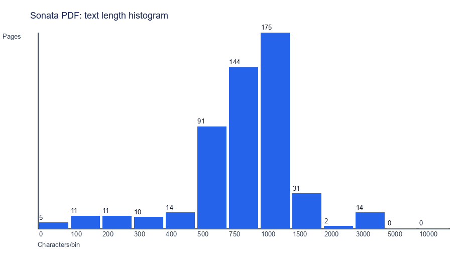
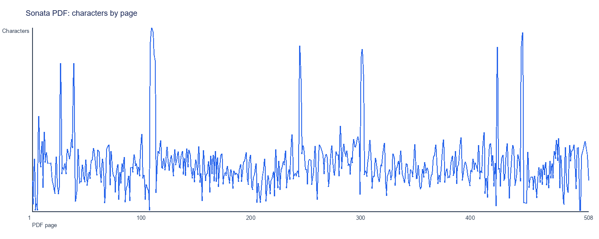
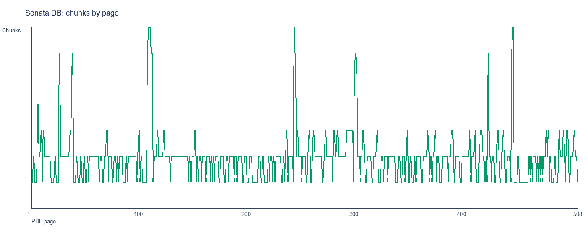
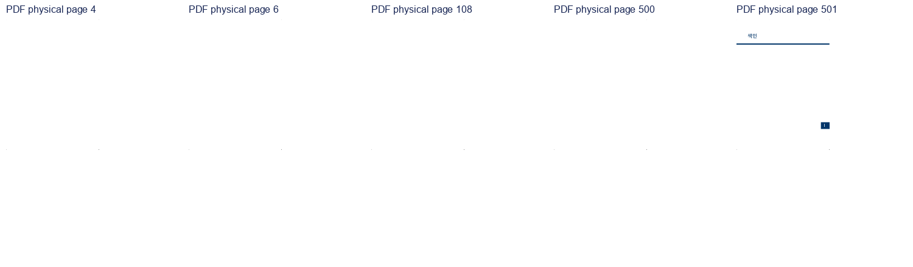

# EDA 보고서: 소나타 원본 PDF

## 대상 및 방법
- 대상: data/DN8_2026_ko_KR.pdf (43,423,714 bytes)
- PDF 텍스트: pypdf.PdfReader 및 page.extract_text(); 핵심 코드 DocumentReader.set_pdf_reader / set_pdf_doc_list와 같은 흐름
- Chapter: CarManualRegisterService._extract_pdf_chapters와 같은 PyMuPDF get_toc(simple=True), level 1 필터, 다음 시작 페이지 - 1 종료 규칙
- 길이: 각 물리 페이지의 추출 문자열 Python len(줄바꿈 포함), None은 0자
- 성공: text가 None이 아니고 strip 후 비어 있지 않음
- 실행 notebook: notebooks/sonata_pdf_eda.ipynb

DB 대조는 CAR_ID 20261003_000014에 대해서만 SELECT했다.

## 페이지 및 추출 결과
| 항목 | 측정값 |
|---|---:|
| 전체 페이지 | 508 |
| 텍스트 추출 성공 | 508 (100.00%) |
| text=None | 0 |
| 빈 문자열 | 0 |
| 공백만 있는 페이지 | 0 |
| 빈 페이지 비율 (세 유형 합산) | 0.00% |
| 추출 예외 | 0 |

## 페이지별 길이 통계
| 통계 | 글자 수 |
|---|---:|
| 평균 | 1019.55 |
| 중앙값 | 944 |
| 최소 | 21 |
| 최대 | 4180 |
| 표준편차 (모집단) | 582.36 |

| 글자 수 범위 | 페이지 수 |
|---|---:|
| 0자 | 0 |
| 1~99자 | 5 |
| 100~499자 | 46 |
| 500~999자 | 235 |
| 1000자 이상 | 222 |

### 100자 미만: 검토 필요 후보
| PDF 물리 페이지 | 글자 수 | 추출 문자열 |
|---:|---:|---|
| 4 | 21 | DN8_KO.book Page 4 |
| 6 | 22 | DN8_KO.book Page ii |
| 108 | 22 | DN8_KO.book Page 24 |
| 500 | 22 | DN8_KO.book Page 54 |
| 501 | 26 | I 색인 DN8_KO.book Page 1 |
짧다는 이유만으로 추출 실패라고 판정하지 않는다. p.4, p.6, p.108, p.500은 식별자/페이지 표기가 대부분이고, p.501은 색인 제목과 표기가 추출됐다. 원본 레이아웃을 시각 확인할 후보로 남긴다.

## Chapter 목차
| 순서 | 제목 | 시작 페이지 | 종료 페이지 |
|---:|---|---:|---:|
| 1 | 1. 안내 및 차량 정보 | 7 | 26 |
| 2 | 2. 안전 및 주의 사항 | 27 | 38 |
| 3 | 3. 시트 및 안전 장치 | 39 | 84 |
| 4 | 4. 클러스터 | 85 | 108 |
| 5 | 5. 편의 장치 | 109 | 244 |
| 6 | 6. 시동 및 주행 | 245 | 300 |
| 7 | 7. 운전자 보조 | 301 | 424 |
| 8 | 8. 비상시 응급 조치 | 425 | 446 |
| 9 | 9. 정기 점검 | 447 | 500 |
| 10 | 색인 | 501 | 508 |

1단계 Chapter는 10개다. 범위는 PDF outline level 1만 반영한다.

## 시각화

Histogram은 페이지별 텍스트 길이 구간의 빈도다. 500자 이상 구간에 대부분의 페이지가 있으며 100자 미만 후보는 다섯 건이다.

페이지 순서별 추출 문자 수를 보여준다. 짧은 후보가 있는 물리 페이지 위치를 확인할 수 있지만, 그래프만으로 추출 오류를 단정하지 않는다.

기존 DB chunk를 PDF 페이지에 대응한 결과다. 전 페이지에서 하나 이상의 chunk가 확인되지만, 이는 page coverage이며 원문 보존의 완전성을 의미하지 않는다.

## 추출 이상 후보
- 추출 예외: 0
- U+FFFD 대체 문자, NUL, 반복 비구두점 문자 20회 이상: 0 페이지
- Unicode private-use 문자 포함 페이지: 0

반복 검사는 목차 점선처럼 정상 레이아웃일 수 있는 구두점을 제외한 문자열 휴리스틱이다. 모든 글리프/시각 오류를 검출한다고 보장하지 않는다.

## DB Chunk page 정합성
기존 Sonata CAR_ID 20261003_000014에서 CAR_MANUAL_CHUNK page_no별 개수를 SELECT했다.

| 항목 | 측정값 |
|---|---:|
| DB chunk 수 | 947 |
| 최소 / 최대 page_no | 1 / 508 |
| 서로 다른 page_no | 508 |
| PDF 페이지 중 chunk 없는 페이지 | 0 |

DB page_no는 PDF 물리 페이지 1~508를 모두 포함한다. 이는 페이지별 chunk 존재를 뜻하며 원문이 전부 보존됐음을 증명하지 않는다.
페이지당 chunk 5개 이상인 곳(상위순 page:count): 110:7, 111:7, 245:7, 448:7, 27:6, 39:6, 109:6, 112:6, 113:6, 302:6, 425:6, 447:6, 246:5, 301:5, 303:5

## 관찰 및 한계
- pypdf는 508페이지 전부에서 비어 있지 않은 텍스트를 반환했다. 빈 문자열, None, 공백 페이지만 있는 페이지 및 예외는 없었다.
- 100자 미만 페이지 다섯 건은 실제 본문이 부족하거나 이미지 위주일 수 있어 검토 후보로 남겼다.
- 텍스트 추출만으로 표/그림의 시각적 정확도, OCR 필요성, 읽기 순서 보존을 판단할 수 없다.
- DB 947 chunk는 page_no 1~508 전체를 덮는다. 누락 문장, 문서 내 시각 요소의 chunk 반영은 이번 비교 범위 밖이다.
- 저텍스트 다섯 페이지를 PDF 이미지로 렌더링해 내용 성격을 확인하는 후속 검토가 권장된다. 이번 분석은 chunk 설정 변경, 재등록 또는 OCR 도입을 결정하지 않는다.

## 결론
소나타 원본은 508페이지이고, 비어 있지 않은 텍스트 추출 성공률은 100.00%다. 빈 페이지 비율은 0%, 평균/중앙값 길이는 1019.55/944자이며 1단계 Chapter 10개를 확인했다. 기존 DB 947 chunk는 전체 PDF page_no에 page-level coverage를 보인다.

## 이미지 데이터 품질 및 정합성

### 범위와 확인 방식

대상은 Hyundai Sonata 2026의 CAR_ID 20261003_000014이며, data/DN8_2026_ko_KR.pdf 및 해당 차량의 CAR_MANUAL_IMAGE/CAR_MANUAL_CHUNK 레코드만 확인했다. DB 질의는 SELECT만 사용했다. 등록 코드 CarManualRegisterService._extract_and_upload_images는 PyMuPDF page.get_images(full=True) 목록을 순회하고 _upload_single_image에서 PDF 이미지 bytes를 추출해 StorageManager.upload_car_image_bytes로 올린다. 아래 PDF resource row 비교는 이 코드 흐름을 기준으로 한다. Supabase 저장 URL마다 HTTP GET을 보내 응답과 실제 이미지 decode를 검사했다. 비밀값과 URL 원문은 출력하거나 저장하지 않았다.

### DB 이미지 레코드

| 검사 항목 | 결과 |
|---|---:|
| DB 이미지 row | 955 |
| 이미지가 있는 PDF 페이지 | 368 |
| URL NULL / 빈 문자열 | 0 / 0 |
| 중복 URL row | 0 |
| page_no NULL / image_no NULL | 0 / 0 |
| 동일 page_no + image_no 중복 그룹 | 0 |
| image_desc NULL | 955 / 955 (100%) |

Chapter별 이미지 수:

| Chapter | 이미지 수 |
|---:|---:|
| 1 | 21 |
| 2 | 7 |
| 3 | 99 |
| 4 | 36 |
| 5 | 222 |
| 6 | 85 |
| 7 | 375 |
| 8 | 39 |
| 9 | 71 |
| 색인(10) | 0 |

페이지별 이미지 row 수 분포(368개 페이지):

| 한 페이지의 이미지 수 | 페이지 수 |
|---:|---:|
| 1 | 107 |
| 2 | 90 |
| 3 | 83 |
| 4 | 57 |
| 5 | 15 |
| 6 | 9 |
| 7 | 3 |
| 8 | 2 |
| 12 | 1 |
| 13 | 1 |

### Supabase Storage 접근 및 파일 검사

955개 URL 전부에 대해 공개 URL HTTP GET 결과는 200이었고, 955개 모두 응답 body를 이미지로 decode했다. 인증된 Storage fallback은 필요하지 않았다.

| 검사 항목 | 결과 |
|---|---:|
| HTTP 200 | 955 |
| 접근 및 decode 성공 | 955 |
| 실패 / 0 byte / decode 불가 | 0 / 0 / 0 |
| Content-Type | image/png 808, image/jpeg 147 |
| Decode format | PNG 808, JPEG 147 |
| 파일 크기 최소 / 중앙값 / 최대 | 435 / 38,718 / 318,762 bytes |
| 관측 해상도 범위 | 14×20 ~ 1453×1157 pixels |

작은 해상도 파일도 이미지 decode가 성공했다. 이 검사에서는 크기만을 근거로 파일 오류라고 판정하지 않았다.

### PDF 원본 이미지와 DB 이미지 대조

PyMuPDF로 페이지마다 get_images(full=True) resource 목록과 get_image_info(xrefs=True) display instance를 각각 측정했다. xref가 0이 아닌 이미지의 extract_image bytes에 SHA-256을 계산했다.

| 항목 | 결과 |
|---|---:|
| PDF 이미지 resource row | 955 |
| PDF 표시 instance 수 | 1,038 |
| PDF 이미지가 있는 페이지 | 368 |
| PDF unique xref 수 | 727 |
| PDF unique byte SHA-256 수 | 727 |
| DB unique downloaded byte SHA-256 수 | 727 |
| PDF/DB SHA-256 집합 일치 | 727 / 727 |
| 페이지별 PDF resource 수와 DB row 수 불일치 | 0 페이지 |

DB 등록 row 수와 PDF resource row 수가 같고 페이지별 개수도 모두 일치했다. PDF 표시 instance가 resource row보다 83건 많은 것은 같은 resource가 PDF 안에서 여러 번 표시되는 instance가 있기 때문이다. 이 데이터에서는 DB에 저장된 원본 bytes의 hash 집합이 PDF에서 추출한 bytes 집합과 모두 일치했다.

페이지 집합 비교:

| 상태 | 페이지 수 |
|---|---:|
| PDF 이미지 있음 / DB 이미지 있음 | 368 |
| PDF 이미지 있음 / DB 이미지 없음 | 0 |
| PDF 이미지 없음 / DB 이미지 있음 | 0 |
| PDF resource 수와 DB 이미지 수가 다른 페이지 | 0 |

### 저텍스트 페이지 시각 검토

아래 다섯 페이지를 PDF에서 렌더링해 육안으로 확인했다. 각 페이지의 PDF image resource/instance 수와 DB image row 수도 모두 0이었다.

| PDF 페이지 | PDF resource / instance | DB 이미지 | 렌더링 관찰 |
|---:|---:|---:|---|
| 4 | 0 / 0 | 0 | 본문 이미지 없이 거의 빈 페이지 |
| 6 | 0 / 0 | 0 | 본문 이미지 없이 거의 빈 페이지 |
| 108 | 0 / 0 | 0 | 본문 이미지 없이 거의 빈 페이지 |
| 500 | 0 / 0 | 0 | 본문 이미지 없이 거의 빈 페이지 |
| 501 | 0 / 0 | 0 | 색인 제목만 보임 |

네 페이지는 시각상 빈 여백/구분 페이지처럼 보이며 p.501에는 색인 표제가 보인다. 의도적으로 비워둔 페이지인지에 대한 편집 의도는 PDF만으로 확인할 수 없다. 이 다섯 페이지에서 누락된 내장 이미지나 이미지 중심 정보는 발견되지 않았다.

### 검색 SQL 이미지 연결 방식 및 중복 재검증

이전 이미지 LEFT JOIN 방식에서는 Sonata의 947개 chunk가 1,842행으로 늘었고, 407개 chunk가 중복 그룹에 포함됐다. 원인은 동일 차량·chapter·page의 이미지가 여러 건이면 각 chunk가 이미지 row마다 반복되는 것이었다. JOIN 조건의 alias만 바꾼 1차 변경은 결과에 차이를 만들지 않았다.

현재 car_manual.sql의 search_car_manual은 이미지 LEFT JOIN을 제거하고, SELECT 절의 correlated subquery에서 동일 차량·chapter·page의 이미지를 CAR_MANUAL_IMAGE_NO 오름차순으로 조회해 첫 URL 하나만 반환한다. 소나타 DB와 실제 CarManualSearchService.search_manual 결과로 확인한 값은 다음과 같다.

| 검증 항목 | 이전 이미지 JOIN | 현재 correlated subquery |
|---|---:|---:|
| 전체 검색 대상 chunk | 947 | 947 |
| 검색 결과 전체 row | 1,842 | 947 |
| distinct chunk | 947 | 947 |
| 중복 chunk 그룹 | 407 | 0 |
| 한 chunk 최대 반환 행 | 13 | 1 |

LIMIT 5와 LIMIT 10은 엔진오일, 후드, 배터리 대표 질문 각각에서 반환 row와 고유 chunk 수가 모두 5/5, 10/10으로 일치했고 중복은 없었다. p.2 / chunk_no 2 (CAR_MANUAL_CHUNK_ID = 20261003_009009)에는 이미지가 3개 있지만 한 행만 반환됐으며, 연결 URL은 가장 작은 CAR_MANUAL_IMAGE_NO인 1번 이미지였다. 이미지가 등록되지 않은 페이지는 URL이 NULL로 반환되어 정상 처리됐다.

대표 질문 top 결과의 similarity 및 chunk 순서는 기존 embedding 검색에서 확인한 순서와 유지됐다. 세 질문 모두 Repository/mapper 결과 매핑 오류 없이 완료됐고, 개별 호출은 약 0.8–2.3초 범위에서 응답했다(단일 측정, embedding 호출 포함).

### 결론 및 한계

소나타 이미지 955개는 HTTP 200 및 이미지 decode에 성공했고, PDF 이미지 resource와 페이지별 DB 이미지 수는 일치했다. DB 이미지 hash 727개는 PDF에서 추출한 unique byte hash 727개와 모두 일치했다. 저텍스트 페이지 p.4, p.6, p.108, p.500, p.501에는 PDF/DB 이미지가 없었다.

이전 이미지 JOIN 방식에서 확인된 chunk 중복은 현재 correlated subquery 방식에서 해결됐다. 전체 결과는 947행/947개 고유 chunk이며, 세 대표 질문의 LIMIT 5/10 결과도 고유 chunk 기준으로 반환됐다. 상관 서브쿼리는 페이지별 CAR_MANUAL_IMAGE_NO가 가장 작은 이미지 하나만 노출하므로 같은 페이지의 나머지 이미지 URL은 검색 결과에서 제공되지 않는다. 또한 image_desc는 현재 955행 모두 NULL이라 이미지 설명 metadata는 없다.
