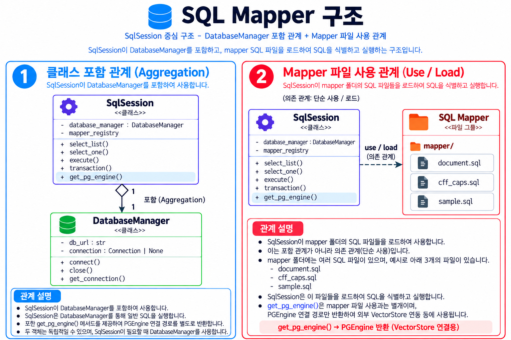
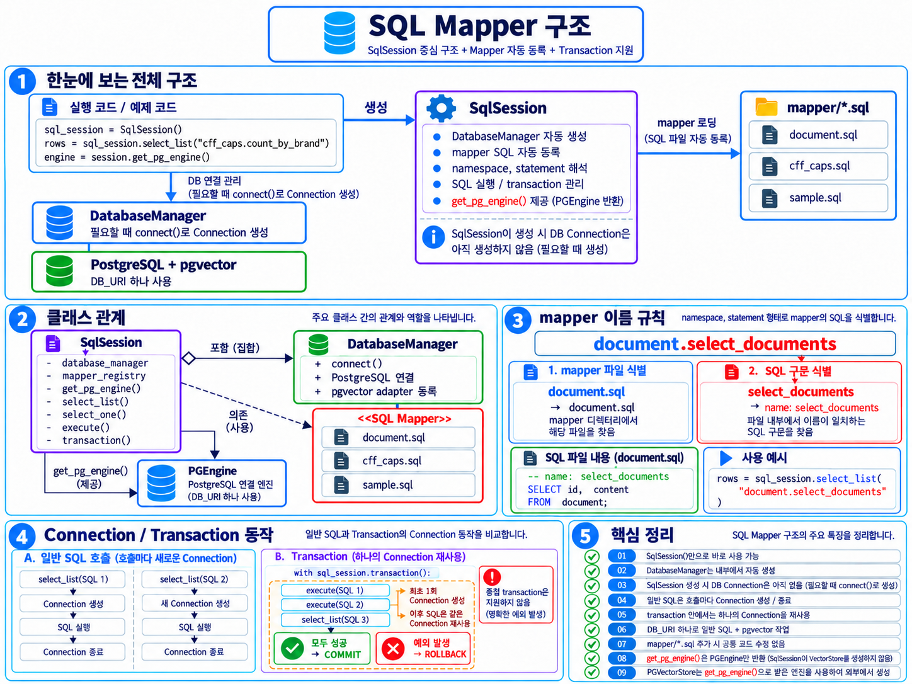

# 개발 공통 가이드

> 공식 개발 문서 사이트의 원본은 `source/*.rst`, 결과는 `build/html/index.html`이다. 이 Markdown은 참고본이며 사이트 내용을 바꿀 때는 해당 RST를 수정하고 `build_html.bat`로 다시 빌드한다.

현재 소스를 기준으로 한 개발자용 안내서다. 구조 그림의 예시 이름과 코드가 다르면 아래의 실제 파일·메서드 이름을 따른다.

## 1. 프로젝트 개요

`group_project/common/`은 DB 연결, SQL Mapper 실행, 문서 읽기 모듈을 제공한다. `car_search_rag/car_search/`의 `coffee_search.py`와 `CoffeeSearchService`가 이를 사용해 커피 머신 PDF 페이지를 등록하거나 매뉴얼을 검색한다. SQL은 `coffee_search.sql`에 있다.

## 2. 전체 프로그램 구조


- `coffee_search.py`: `CoffeeSearch`에서 PDF를 읽고, `coffee_machine_register()`가 등록 절차를 호출한다. 파일 하단의 현재 활성 코드에서는 `SqlSession`과 `CoffeeSearchService`를 만들어 검색 테스트를 실행한다.
- `coffee_search_service.py`: 한국어 구간 추출, 문서·질문 임베딩, 머신·상세 등록, 유사도 검색을 담당한다.
- `common/document_reader.py`의 `DocumentReader`: PDF를 페이지 번호와 텍스트의 `doc_list`로 변환한다.
- `OpenAIEmbeddings`: 서비스에서 문서 등록 시 `embed_documents()`, 검색 시 `embed_query()`로 호출한다.
- `common/sql_session.py`의 `SqlSession`: `coffee_search.sql` 등 mapper를 등록하고 SQL을 실행한다.
- `common/database_manager.py`의 `DatabaseManager`: 필요할 때 PostgreSQL 연결을 만들고 pgvector 타입을 등록한다.

그림은 등록·검색의 가능한 흐름을 함께 보여준다. **현재 `coffee_search.py`의 등록 호출은 주석 처리되어 있어 기본 실행은 검색만 수행한다.** `common/vector_store_manager.py`는 현재 빈 파일이다.

## 3. 디렉터리 구조

아래 경로의 기준은 `src/group_project/`다. 실행 설정 파일은 저장소 루트에 있다.

```text
group_project/
├─ AGENTS.md
├─ common/
│  ├─ database_manager.py
│  ├─ document_reader.py
│  ├─ sql_session.py
│  └─ vector_store_manager.py
├─ data/
│  └─ 에센자미니_c30.pdf
├─ car_search_rag/
│  ├─ AGENTS.md
│  ├─ run_car_search.bat
│  └─ car_search/
│     ├─ coffee_search.py
│     ├─ coffee_search_service.py
│     ├─ coffee_search.sql
│     ├─ document.py / document_service.py / document.sql
│     ├─ query_examples.py / query_examples_service.py / query_examples.sql
│     └─ transaction_sample.py / transaction_sample_service.py / transaction_sample.sql
└─ docs/
   ├─ development_guide.md
   ├─ sql_mapper.md
   ├─ coffee_search_structure.png
   ├─ sql_mapper_structure.png
   ├─ sql_mapper_structure_simple.png
   ├─ build_html.bat
   └─ source/                  # Sphinx 원본; build/html은 생성 결과
```

## 4. 공통 영역

### 4.1 `SqlSession`

생성 시 `MAPPER_ROOT`인 `group_project/` 아래의 모든 `*.sql`을 재귀적으로 aiosql에 등록한다. `파일명.statement` ID로 호출한다. `select_list()`는 전체 행의 목록, `select_one()`은 첫 행 또는 `None`, `execute()`는 aiosql 실행 결과를 반환한다. `execute_many()`는 `cursor.executemany()`로 배치를 실행하고 `rowcount`를 반환한다. `transaction()`은 여러 호출에 연결 하나를 공유한다. 조회 결과 키는 기본적으로 camelCase이며 `camel_case_keys=False`로 원래 컬럼명을 유지한다.

`sql_log_mode`는 `combined`(기본값: SQL에 로그용 파라미터 결합), `separate`(SQL 원문과 `PARAMS` 분리), `none`을 지원한다. 단, `execute()`는 `none`에서도 QUERY 로그를 강제로 남긴다. `result_log=True`는 SQL 모드와 독립적으로 반환 행을 표로 기록하며 `result_log_limit` 기본값은 100이다. `pgvector.utils.Vector`와 32개 이상 숫자로 된 list·tuple은 로그에서 앞 6개 값과 전체 차원만 `<VECTOR [0.012345, ...] dimension=1536>` 형식으로 표시한다. 중첩된 dict·list·tuple에도 적용되고 실행 파라미터는 원본을 사용한다. `execute_many()`는 INFO 로그가 활성화되면 실행 전에 SQL과 모든 배치 건의 순번·축약된 파라미터를 출력하고, 완료 로그도 유지한다.

`execute()`는 dict 한 건으로 SQL을 한 번 실행한다. 같은 SQL을 여러 건에 적용할 때는 dict 목록을 `execute_many()`에 전달한다. 예를 들어 `parameters_list = [{"CFF_MACH_ID": machine_id, "PAGE_NO": "1", "TEXT": "첫 번째 내용", "EMBEDDING": Vector(embeddings[0]), "USER_ID": user_id}, ...]`를 `session.execute_many("coffee_search.insert_machine_detail", parameters_list)`로 등록한다. 내부에서는 같은 SQL에 각 dict를 적용하도록 `cursor.executemany()`를 호출한다. 빈 목록은 0을 반환한다. 여러 변경을 묶으려면 `transaction()` 안에서 호출하며 정상 종료 시 COMMIT, 예외가 전파되면 ROLLBACK한다. 사용 예와 Batch 로그 형식은 공식 [SQL / SqlSession 사용 가이드](./build/html/sql_mapper_guide.html)를 참고한다.

`get_pg_engine()`은 `DB_URL`로 `PGEngine`을 지연 생성·재사용한다. 현재 Coffee Search 서비스는 이 메서드를 호출하지 않고 `SqlSession`의 psycopg SQL 경로를 사용한다.

### 4.2 `DatabaseManager`

생성 시 `load_dotenv()`를 호출한다. `connect()`는 `DB_URL`로 **새** psycopg 연결을 만들고 `register_vector()`를 호출한다. `SqlSession`이 이를 필요할 때 사용한다. `camel_case_keys=False`면 연결의 row factory가 `dict_row`가 된다.

### 4.3 `DocumentReader`

Coffee Search의 `CoffeeSearch(file_path)`는 `DocumentReader(file_path) → set_pdf_reader() → set_pdf_doc_list()`를 호출한다. 결과 `doc_list`는 PDF의 각 페이지를 `{"page_no": 1부터 시작하는 번호, "text": 추출 텍스트}`로 담는다. `set_pdf_chunk_doc_list()`는 현재 `구현 예정`만 출력하므로 등록 흐름에 포함되지 않는다.

### 4.4 `VectorStoreManager`

`common/vector_store_manager.py` 파일은 존재하지만 현재 내용이 없고 Coffee Search에서 사용하지 않는다. 별도 Vector Store 관리 기능이 구현된 것으로 가정하지 않는다.

## 5. SQL Mapper 사용법





`coffee_search.sql`의 `-- name: select_machine`은 `self.sql_session.select_one("coffee_search.select_machine", {"BRAND": brand, "MACHINE_NAME": machine_name})`으로 호출한다. `coffee_search`는 파일 stem(namespace), `select_machine`은 `-- name:`의 statement 이름이다. `insert_machine!`처럼 `!`가 붙은 변경문도 Python 호출 ID는 `coffee_search.insert_machine`이다. SQL의 `:BRAND` 같은 이름은 전달 dict의 키와 맞춘다.

SQL 파일은 별도의 `mapper/` 디렉터리에 모아 두지 않는다. `SqlSession`은 `group_project/` 아래에서 찾아 등록한다. 그림의 `mapper/`, `cff_caps.sql`, `sample.sql`, `mapper_registry`, `get_connection()`, `close()`는 현재 구현을 그대로 나타내는 이름이 아니다. 실제 사용법의 짧은 요약은 [sql_mapper.md](./sql_mapper.md)를 참고한다.

## 6. Connection / Transaction

일반 `select_list()`·`execute()` 호출은 필요할 때 새 연결을 열어 실행한 뒤 닫는다. `select_one()`은 `select_list()`를 호출한다. 여러 SQL을 원자적으로 묶을 때는 다음처럼 사용한다.

```python
with sql_session.transaction():
    sql_session.execute("coffee_search.delete_machine_details", {"CFF_MACH_ID": machine_id})
    sql_session.execute_many("coffee_search.insert_machine_detail", batch_params)
```

블록 안의 호출은 같은 연결을 재사용한다. 정상 종료 시 COMMIT, 예외 시 ROLLBACK하고 연결을 닫는다. 중첩 `transaction()`은 지원하지 않는다. [SQL Mapper 구조 그림](./sql_mapper_structure.png)과 [sql_mapper.md](./sql_mapper.md)도 참고한다.

## 7. Coffee Search 프로그램 구조

`coffee_search.py`에는 `CoffeeSearch`(PDF 읽기), `coffee_machine_register()`(등록 호출), 파일 하단의 검색 테스트가 있다. 활성 검색 테스트는 질문·브랜드·모델명·`limit=5`를 서비스에 전달하고 결과를 출력한다. 등록 호출 예시는 주석 처리되어 있다.

`CoffeeSearchService`의 실제 메서드는 `pdf_filter()`, `insert_pdf_docs()`, `insert_machine_details()`, `search_machine_manual()`이다. SQL statement는 다음과 같다.

| `coffee_search.sql` statement | 역할 / 현재 호출 |
| --- | --- |
| `select_machine`, `generate_biz_id`, `insert_machine` | 등록 중 기존 머신 조회, ID 생성, 없으면 머신 등록 |
| `delete_machine_details`, `insert_machine_detail` | 등록 중 기존 상세 삭제, 페이지 상세 배치 등록 |
| `search_machine_manual` | 질문 벡터로 매뉴얼 검색 |
| `select_test`, `lock_machine_registration`, `select_detail_by_page` | SQL에는 있지만 현재 `CoffeeSearchService`에서 호출하지 않음 |

## 8. PDF 등록 흐름

PDF 입력 파일은 `group_project/data/에센자미니_c30.pdf`다. 현재 코드의 등록 경로는 `coffee_machine_register()` → `CoffeeSearch(file_path)` → `DocumentReader.set_pdf_reader()` → `set_pdf_doc_list()` → `doc_list` → `CoffeeSearchService.pdf_filter()` → `insert_pdf_docs()` 순서다. `pdf_filter()`는 각 페이지의 `KR` 뒤부터 다음 언어 코드 등 이전까지의 텍스트를 추출하고 빈 결과는 제외한다.

`insert_pdf_docs()`는 텍스트 목록을 `OpenAIEmbeddings.embed_documents()`로 임베딩한 다음 트랜잭션을 연다. 머신을 조회하고, 없으면 `FN_GEN_BIZ_ID`로 ID를 받아 `CFF_MACH`에 등록한다. 해당 머신의 `CFF_MACH_DTL`을 삭제한 후 `insert_machine_details()`가 각 페이지 번호·텍스트·`Vector`를 만들어 `execute_many("coffee_search.insert_machine_detail", ...)`로 다시 등록한다. **재실행하면 해당 머신의 기존 상세가 삭제·재등록된다.** 현재 기본 실행은 이 등록 경로를 호출하지 않는다.

## 9. 질문 검색 흐름

현재 활성 예제 질문은 `"커피가 나오지 않을 때 어떻게 해야 하나요?"`다. `search_machine_manual()`이 `OpenAIEmbeddings.embed_query()` 결과를 `Vector`로 바꾸고 `SqlSession.select_list("coffee_search.search_machine_manual", ...)`에 전달한다. SQL은 `CFF_MACH`와 `CFF_MACH_DTL`을 `CFF_MACH_ID`로 JOIN하고 브랜드 `CFF_MACH_BRAND`와 모델명 `CFF_MACH_NM`으로 거른다. `D.CFF_MACH_EMBED_VEC <=> :EMBEDDING`(cosine distance) 오름차순으로 정렬하고 `LIMIT :LIMIT`만큼 반환한다. `SIMILARITY`는 `1 - distance`로 계산한다.

반환 SQL 컬럼은 `CFF_MACH_ID`, `BRAND`, `MACHINE_NAME`, `CFF_MACH_PAGE_NO`, `CFF_MACH_EMBED_TXT`, `SIMILARITY`다. 기본 `camel_case_keys=True`에서는 반환 dict의 밑줄 이름이 camelCase로 바뀐다. 저장 대상의 주요 컬럼은 `CFF_MACH(CFF_MACH_ID, CFF_MACH_BRAND, CFF_MACH_NM)`와 `CFF_MACH_DTL(CFF_MACH_ID, CFF_MACH_DTL_ID, CFF_MACH_PAGE_NO, CFF_MACH_EMBED_TXT, CFF_MACH_EMBED_VEC)`다.

## 10. Embedding / pgvector 사용

`coffee_search_service.py`의 모델 상수는 `text-embedding-3-small`, 차원 상수는 `EMBEDDING_DIMENSION = 1536`이다. 코드는 이 차원 상수를 별도로 검증에 사용하지 않는다. 문서 등록은 `embed_documents()`, 질문 검색은 `embed_query()`를 호출하며 두 결과를 `pgvector.utils.Vector`로 감싸 DB에 전달한다. 저장 컬럼은 `CFF_MACH_DTL.CFF_MACH_EMBED_VEC`, 검색 연산자는 `<=>`다. 확인한 DB 덤프에서 이 컬럼은 `public.vector`이고 1536차원 제약은 컬럼 선언에 없다. DB는 pgvector 타입과 `FN_GEN_BIZ_ID` 함수를 갖춰야 한다.

## 11. 새로운 기능 추가 방법

새 SQL은 해당 기능의 `.sql`에 `-- name:`을 추가하고 Service에서 `SqlSession`의 `파일명.statement` ID로 호출한다. 사용자 입력과 실행 순서는 진입점 `.py`에 연결한다. Coffee Search 업무 규칙은 `coffee_search_service.py`, PDF 읽기 공통 처리는 `common/document_reader.py`, 공통 DB 실행 기능은 `common/sql_session.py` 또는 연결 기능에 따라 `common/database_manager.py`에서 다룬다. DB SQL은 Python 문자열에 작성하지 않는다.

## 12. 시작하기

아래 명령의 작업 디렉터리는 `pyproject.toml`과 `uv.lock`이 있는 **저장소 루트**다. `pyproject.toml`은 Python 3.14 이상과 실제 의존성을 선언한다. 루트 `requirements.txt`는 현재 `streamlit` 한 줄뿐이므로 `pip install -r requirements.txt`만으로 Coffee Search를 실행할 수 없다. 의존성 설치에는 잠금 파일을 사용하는 다음 명령을 사용한다.

```powershell
uv sync --locked
```

이 명령은 `.venv` 가상환경을 만들거나 갱신한다. 저장소 루트의 `.env` 또는 실행 환경에 `DB_URL`과 `OPENAI_API_KEY`를 설정한다. `DB_URL`은 psycopg가 사용할 PostgreSQL 연결 문자열이다. DB에는 pgvector 타입, `CFF_MACH`·`CFF_MACH_DTL` 테이블, `FN_GEN_BIZ_ID` 함수가 있어야 한다. 현재 검색 데이터가 없으면 검색 결과는 비어 있을 수 있다. PDF 등록을 실행하려면 위 PDF 파일이 있어야 한다.

Windows에서는 저장소 루트에서 다음처럼 실행한다. 배치 파일은 자체 위치인 `car_search_rag/`로 이동한 뒤 `python car_search/coffee_search.py`를 실행한다.

```powershell
uv run python src/group_project/car_search_rag/car_search/coffee_search.py
```

```powershell
.\.venv\Scripts\Activate.ps1
.\src\group_project\car_search_rag\run_car_search.bat
```

직접 실행할 때는 `uv run python` 대신 활성화된 가상환경에서 `python src/group_project/car_search_rag/car_search/coffee_search.py`를 사용해도 된다. **실행 시 DB 연결과 OpenAI 임베딩 API 호출이 발생한다.** 검색 테스트는 기존 데이터만 조회한다. 등록은 `coffee_search.py`의 주석 처리된 호출을 활성화했을 때만 실행되며 기존 상세를 삭제·재등록한다.

## 13. 기존 문서 연결

[sql_mapper.md](./sql_mapper.md)는 Mapper와 연결·트랜잭션의 짧은 참고 문서다. 위 세 이미지는 구조 이해를 돕는 자료이며, 그림 속 예시 파일·메서드 이름이 현재 코드와 다른 부분은 이 가이드의 실제 경로와 설명을 따른다. Sphinx 문서의 원본은 `docs/source/`이고 `docs/build_html.bat`가 HTML을 생성한다.
