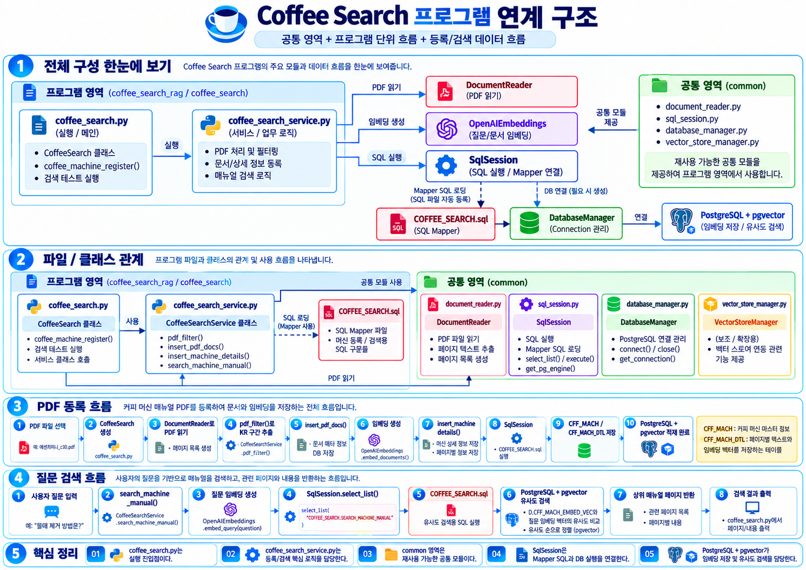

개발 공통 가이드
==================

이 페이지는 Coffee Search의 실행 경로와 공통 모듈의 경계를 설명합니다. 시작 명령은 :doc:`getting_started`, SQL 작성과 로그 옵션은 :doc:`sql_mapper_guide`, 실제 파일 트리는 :doc:`project_structure` 에서 확인할 수 있습니다.

전체 프로그램 구조
--------------------

``coffee_search.py`` 가 진입점이고 ``CoffeeSearchService`` 에 등록·검색을 요청합니다. PDF 읽기는 ``DocumentReader``, 임베딩은 ``OpenAIEmbeddings``, SQL 실행은 ``SqlSession`` 이 맡습니다. 서비스의 SQL 호출은 ``coffee_search.sql`` 의 statement로 이어지고, ``SqlSession`` 은 ``DatabaseManager`` 가 만든 PostgreSQL 연결을 사용합니다. DB의 벡터 저장과 유사도 연산에는 pgvector 타입이 필요합니다.

그림에는 등록과 검색 흐름을 함께 그렸지만 **현재 메인 스크립트의 활성 코드는 검색 테스트뿐** 입니다. ``VectorStoreManager`` 로 표시된 영역은 현재 빈 파일입니다. 그림의 메서드·경로 예시는 아래의 실제 소스를 우선해 읽으세요.

실행 파일 → Service → SQL
------------------------------------------

``coffee_search.py`` 의 파일 하단은 ``SqlSession(result_log=True)`` 와 ``CoffeeSearchService`` 를 생성한 뒤 ``search_machine_manual()`` 을 호출합니다. ``CoffeeSearch`` 클래스는 등록 경로에서 PDF를 ``DocumentReader`` 로 읽습니다. ``coffee_machine_register()`` 는 PDF 필터와 등록 서비스를 연결하지만 호출 예시는 주석 처리되어 있습니다.

.. code-block:: python

   session = SqlSession(result_log=True)
   coffee_search_service = CoffeeSearchService(sql_session=session)
   search_docs = coffee_search_service.search_machine_manual(
       brand="네스프레소",
       machine_name="에센자 미니",
       question="커피가 나오지 않을 때 어떻게 해야 하나요?",
       limit=5,
   )

실제 스크립트에서는 서비스 변수 이름을 ``coffeeSearchService`` 로 사용합니다. 위 예제는 동일한 생성·호출 API를 보여줍니다. ``coffee_search.sql`` 에는 머신 조회와 상세 등록, 검색 statement가 있고 서비스는 이를 ``coffee_search.statement`` 이름으로 호출합니다.

공통 영역
----------

``common/sql_session.py`` 의 ``SqlSession`` 은 생성 시 ``group_project/`` 아래 ``*.sql`` 을 aiosql에 등록합니다. ``select_list()`` 와 ``select_one()`` 은 조회, ``execute()`` 와 ``execute_many()`` 는 변경·배치 실행에 사용합니다. ``transaction()`` 은 여러 호출이 같은 연결을 쓰도록 묶습니다. ``result_log`` 는 반환 행을 표로 표시하고 ``sql_log_mode`` 는 QUERY 로그 형식을 정합니다. ``Vector`` 파라미터는 로그에서 앞부분 값과 차원만 표시하며 원본은 DB에 전달합니다. ``execute_many()`` 는 INFO 로그가 활성화되면 모든 배치 건의 파라미터를 순번과 함께 출력합니다. ``get_pg_engine()`` 은 ``DB_URL`` 로 ``PGEngine`` 을 지연 생성하지만 Coffee Search는 현재 이 경로를 사용하지 않습니다.

``common/database_manager.py`` 의 ``DatabaseManager`` 는 ``load_dotenv()`` 로 환경을 읽고 ``connect()`` 호출마다 psycopg 연결을 만듭니다. 연결 직후 pgvector 어댑터를 등록합니다. ``common/document_reader.py`` 의 ``DocumentReader`` 는 PDF를 페이지 번호와 추출 텍스트의 ``doc_list`` 로 바꿉니다. ``common/vector_store_manager.py`` 는 존재하지만 현재 내용이 없어 사용하지 않습니다.

Coffee Search 영역과 PDF 등록
------------------------------------------------

등록 입력 PDF는 ``group_project/data/에센자미니_c30.pdf`` 입니다. 다음은 현재 구현된 순서입니다. 등록 함수는 구현되어 있으나 메인 스크립트에서 호출은 주석 처리되어 있습니다.

1. ``coffee_machine_register()`` 가 ``CoffeeSearch(file_path)`` 를 만듭니다. 생성자에서 ``DocumentReader(file_path)`` → ``set_pdf_reader()`` → ``set_pdf_doc_list()`` 를 호출해 페이지별 ``document_reader.doc_list`` 를 준비합니다.
2. ``CoffeeSearchService.pdf_filter()`` 가 각 페이지의 ``KR`` 뒤 텍스트를 다음 언어 코드 등의 경계까지 추출합니다. 추출 텍스트가 없으면 그 페이지를 제외하고 원본 페이지 번호를 유지합니다.
3. ``insert_pdf_docs()`` 가 텍스트 목록을 ``OpenAIEmbeddings.embed_documents()`` 에 전달합니다. 반환값은 상세 등록 시 ``Vector`` 로 변환합니다.
4. ``SqlSession.transaction()`` 안에서 ``coffee_search.select_machine`` 으로 기존 머신을 찾습니다. 없으면 ``generate_biz_id`` 로 ID를 받고 ``insert_machine`` 으로 ``CFF_MACH`` 에 등록합니다.
5. ``delete_machine_details`` 로 해당 머신의 기존 ``CFF_MACH_DTL`` 행을 지웁니다. ``insert_machine_details()`` 가 페이지 번호·텍스트·벡터를 맞춰 배치 파라미터를 만들고 ``execute_many("coffee_search.insert_machine_detail", ...)`` 로 상세를 다시 넣습니다.

임베딩 호출은 트랜잭션에 **들어가기 전** 에 이루어집니다. 따라서 API 호출이 실패하면 DB 변경이 시작되지 않습니다. 재등록 시 기존 상세 행은 삭제·재생성되므로 등록 호출을 활성화할 때 이 동작을 고려하세요. ``DocumentReader.set_pdf_chunk_doc_list()`` 는 현재 ``구현 예정`` 만 출력하며 이 흐름에 쓰이지 않습니다.

질문 검색과 Vector 검색
--------------------------------

현재 활성 경로는 ``CoffeeSearchService.search_machine_manual()`` → ``OpenAIEmbeddings.embed_query(question)`` → ``Vector(query_vector)`` → ``SqlSession.select_list("coffee_search.search_machine_manual", ...)`` 순서입니다. 브랜드와 모델명, 질문 벡터, ``LIMIT`` 을 SQL 파라미터로 전달합니다.

SQL은 ``CFF_MACH`` 와 ``CFF_MACH_DTL`` 을 ``CFF_MACH_ID`` 로 JOIN하고 ``CFF_MACH_BRAND`` 및 ``CFF_MACH_NM`` 으로 머신을 제한합니다. ``D.CFF_MACH_EMBED_VEC <=> :EMBEDDING`` 값이 작은 순서로 정렬한 뒤 ``LIMIT :LIMIT`` 만큼 반환합니다. 이 연산은 cosine distance이고 SELECT의 ``SIMILARITY`` 는 ``1 - distance`` 입니다.

``CFF_MACH_PAGE_NO`` 는 원본 PDF 페이지 번호, ``CFF_MACH_EMBED_TXT`` 는 저장한 한국어 텍스트입니다. ``CFF_MACH_EMBED_VEC`` 는 저장·검색에 쓰지만 현재 SELECT 결과에는 포함하지 않습니다. 반환 행에는 머신 ID, 브랜드·모델명, 페이지 번호·텍스트, ``SIMILARITY`` 가 있습니다. 기본 ``camel_case_keys=True`` 에서는 dict의 밑줄 컬럼명이 camelCase로 변환됩니다.

Embedding / pgvector
----------------------------------------

서비스 상수는 ``EMBEDDING_MODEL = "text-embedding-3-small"`` 과 ``EMBEDDING_DIMENSION = 1536`` 입니다. 현재 코드는 차원 상수를 별도 검증에 사용하지 않습니다. 문서 등록은 ``embed_documents()``, 검색 질문은 ``embed_query()`` 를 사용합니다. DB 저장 컬럼은 ``CFF_MACH_DTL.CFF_MACH_EMBED_VEC`` 입니다. 현재 확인한 DB 덤프의 이 컬럼 선언은 ``public.vector`` 이며 1536차원 제약은 선언에 없습니다. 벡터 파라미터는 ``pgvector.utils.Vector`` 로 전달하고 ``DatabaseManager`` 가 연결에 pgvector 어댑터를 등록합니다.

SQL Mapper와 Connection / Transaction
------------------------------------------------------------------------

``coffee_search.sql`` 의 ``-- name: select_machine`` 은 다음처럼 호출합니다. ``coffee_search`` 가 파일 stem(namespace)이고 ``select_machine`` 이 statement 이름입니다.

.. code-block:: python

   machine = self.sql_session.select_one(
       "coffee_search.select_machine",
       {"BRAND": brand, "MACHINE_NAME": machine_name},
   )

일반 호출은 필요한 연결을 하나 열어 실행하고 닫습니다. ``transaction()`` 안에서는 연결 하나를 재사용하며 정상 종료 시 COMMIT, 예외 시 ROLLBACK합니다. 등록은 머신 조회·등록과 상세 교체가 한 작업이므로 이 경로를 사용합니다. 전체 Mapper 구조와 로그 모드 예시는 :doc:`sql_mapper_guide` 에 있습니다.

새 기능의 변경 위치
----------------------

새 SQL은 해당 기능의 ``.sql`` 에 ``-- name:`` 으로 정의하고 Service에서 ``SqlSession`` 으로 호출합니다. Coffee Search의 업무 규칙과 임베딩 순서는 ``coffee_search_service.py``, 실행 입력·출력은 ``coffee_search.py`` 에서 변경합니다. 여러 프로그램에 필요한 PDF 읽기는 ``common/document_reader.py``, SQL 실행·연결의 공통 변경은 ``common/sql_session.py`` 와 ``common/database_manager.py`` 에서 다룹니다. 실제 파일 목록은 :doc:`project_structure` 에 있습니다.

현재 구현 상태와 주의사항
----------------------------

* 기본 실행은 검색만 수행합니다. PDF 등록 호출은 주석 처리되어 있습니다.
* ``coffee_search.sql`` 의 ``select_test``, ``lock_machine_registration``, ``select_detail_by_page`` 는 현재 ``CoffeeSearchService`` 에서 호출하지 않습니다.
* ``common/vector_store_manager.py`` 와 PDF 청크 설정은 현재 구현된 저장 흐름이 아닙니다.
* 구조 그림의 일부 파일·메서드 이름은 현재 소스와 다릅니다. 이 문서의 파일명과 실제 코드를 기준으로 작업하세요.
