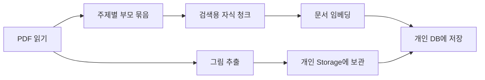
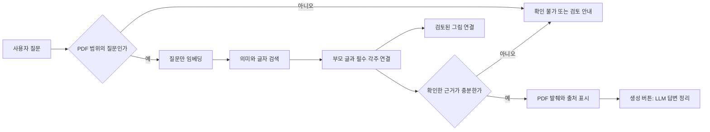

# 싼타페 HEV 챗봇 — 코드리뷰 설명 안내

정리일: 2026-10-05. 개인 폴더의 현재 코드와 저장된 실험 기록을 읽어 정리했습니다. 이번 코드 정리 후 검색·생성 실험은 재실행하지 않았습니다. 아래 숫자는 각 실험 당시의 기록입니다.

**후속 확인 2026-10-06:** 이후 실제 화면·새 표현 평가·원문 검토를 진행했습니다. [순서별 확인 안내](./sequence_completion_guide.md)와 `review_revision_summary_20261006.json`을 함께 보세요. 아래 '재실행하지 않았다'는 문장은 최초 코드리뷰 정리 단계 당시의 범위입니다. 기본 모델은 유지하고 부분 검토 자료를 별도 버전으로 저장합니다.

## 1. 먼저 이 한 문장으로 설명하기

**“싼타페 HEV 설명서에서 질문과 관련된 내용을 찾고, 확인된 글·출처·그림을 함께 보여주는 PDF 기반 RAG 챗봇입니다.”**

RAG는 답변 전에 자료를 찾아서 읽는 방식입니다. 우리 프로그램은 설명서 779쪽을 준비해 두고, 질문할 때 관련 부분만 찾습니다. 현재 차량의 고장 진단·리콜 대상 확인이나 웹 검색 기능은 구현 범위에 포함하지 않습니다.

## 2. 자료 준비와 질문 처리는 따로 설명하기

위는 **자료를 준비하는 작업**입니다. 임베딩은 글을 의미 비교에 사용할 숫자 배열로 바꾸는 일입니다. 현재 부모 527개, 자식 청크 2,213개와 그림 864개를 저장했습니다. OpenAI 전환 때 같은 자식 청크에 새 벡터를 만들었고 원문·그림은 다시 저장하지 않았습니다.

위는 **사용자가 질문할 때의 작업**입니다. 매 질문마다 문서 2,213개를 다시 임베딩하지 않습니다. 질문만 임베딩합니다. OpenAI 검색을 선택하면 질문 임베딩 API가 호출되고, 답변 생성 버튼을 누르면 별도의 생성 API가 호출됩니다.

## 3. 부모 묶음과 자식 청크가 필요한 이유

예를 들어 부모에는 ‘안전벨트 착용’의 설명·금지사항·그림 연결을 함께 보관합니다. 자식에는 그 글을 입력 한도에 맞춰 나눈 작은 부분을 보관합니다.

- **자식의 역할:** “차단 클립을 꽂으면?”처럼 짧은 질문에 해당하는 부분을 찾습니다.
- **부모의 역할:** 찾은 부분의 주변 설명과 경고를 함께 읽습니다.
- **연결 ID의 역할:** 자식이 어느 부모에서 나왔는지 알려줍니다. 필요한 각주도 별도 기록 ID로 연결합니다.
- **쪽수의 역할:** 원문을 다시 찾을 출처입니다. PDF 쪽수와 인쇄된 매뉴얼 쪽수는 별도로 보관합니다.

`raw_text`는 추출 원문, `content`는 검색할 글입니다. 검색용 글에서는 불필요한 그림 코드·꼬리말을 처리하고 깨진 경고 표기를 보완하지만 원문은 별도로 유지합니다. 확인한 표는 행·단위·각주를 보존하고, 입력 한도 때문에 중요한 내용을 무조건 잘라 버리지 않습니다.

OpenAI 전환 후에도 비교를 위해 기존 청크를 그대로 사용했습니다. 따라서 더 큰 입력 한도를 활용하도록 청킹을 새로 최적화한 실험은 아닙니다.

## 4. 질문 하나가 지나가는 코드 순서

“실외 미러 접이 버튼 위치를 그림으로 보여줘”를 예로 설명하면 됩니다.

| 순서 | 주요 파일 | 하는 일 |
|---|---|---|
| 1 | `app.py` | 질문을 받고 답변·출처·관련 그림 탭을 표시 |
| 2 | `answer_service.py` | PDF 범위 판단, 명시적인 복합 질문 분리, 답변 근거 선택 |
| 3 | `openai_search_service.py` | 지정한 벡터 저장 버전을 확인하고 질문을 OpenAI로 임베딩 |
| 4 | `database.py`, 개인 `mappers` | 개인 작업의 글·벡터·그림 연결을 읽기 전용으로 조회 |
| 5 | `search_support.py`, `retrieval.py` | 같은 자료의 점수를 계산하고 관련 부모 후보 정렬 |
| 6 | `db_search_service.py` | 부모 글·필수 문맥·그림 참조를 연결하고 중복 제거 |
| 7 | `answer_service.py` | 검토 상태를 확인해 발췌·출처·표시 가능한 그림 준비 |
| 8 | `llm_answer_service.py` | 생성 요청 때만 확인된 근거를 LLM에 보내고 응답 형식·인용 검사 |

이 질문은 차량 내부 I 안내도와 4번 항목을 찾습니다. 그림은 연결 ID·쪽수·검토 상태·업로드 경로로 가져옵니다. “주행 중 미러를 조정해도 돼?”처럼 조작·허용 여부를 묻는 질문은 위치 안내도만으로 답하지 않고 직접 지시가 있는 설명문을 선택하도록 보완했습니다.

자료 준비 코드는 따로 있습니다. `manual_service.py`가 PDF 읽기·주제 구성·원문 보완·청킹을 묶고, `full_store_service.py`가 명시적 저장 작업을 담당합니다. `openai_migration.py`는 기존 청크에 새 벡터를 저장하는 전환 도구입니다.

## 5. 모델과 검색을 정확하게 설명하기

| 역할 | 현재 코드에서 사용하는 것 | 설명 |
|---|---|---|
| 현재 기본 검색 임베딩 | `text-embedding-3-small`, 1536차원 | LangChain `OpenAIEmbeddings`로 문서·질문 벡터 생성 |
| 기존 비교용 검색 임베딩 | `jhgan/ko-sroberta-multitask-mrl`, 768차원 | PC의 로컬 모델로 계산. 별도 벡터로 보존 |
| 글자 검색 | scikit-learn TF-IDF, 글자 2~4개 단위 | 부품명·구체 표현의 일치 보완 |
| 검색 규칙 | 의미/글자 점수 기본 50:50, 목적별 자료 선택, 구체 표현 보너스 | 직접 작성한 규칙. 별도 재순위 LLM은 없음 |
| 답변 생성 | `gpt-6-luna`, 추론 `none` | LangChain `ChatOpenAI`로 선택한 PDF 근거 정리 |

**우리 검색은 임베딩과 TF-IDF를 결합합니다.** `retrieval.py`는 근거를 찾는 자체 검색 코드이며 LangChain `BaseRetriever`를 상속하거나 `RetrievalQA`를 그대로 사용한 구현은 아닙니다. LangChain은 OpenAI 임베딩과 생성 연결에 사용합니다.

벡터는 PostgreSQL의 pgvector 자료형으로 저장합니다. 현재 기본 결합 검색은 저장된 벡터를 읽어 Python에서 의미·글자·목적 점수를 계산합니다. 기존 로컬의 `semantic` 방식에는 SQL pgvector 코사인 검색도 있습니다. 따라서 “모든 기본 검색 점수를 DB에서 계산한다”라고 설명하면 부정확합니다.

답변 쪽은 `ChatPromptTemplate → ChatOpenAI → StrOutputParser → 자체 JSON·출처 검사` 흐름입니다. JSON 형식과 실제 존재하는 출처 번호를 검사하며, **내용의 모든 수치·조건이 맞는지 의미까지 자동 검증하는 기능은 아닙니다.** 문제가 있으면 원문 발췌로 돌아갑니다.

수업에서 확인한 개념·도구와 프로젝트에서 선택한 모델은 `learning_additions.md`에서 구별합니다. 모델 이름이 다르다는 이유로 수업에서 해당 모델까지 사용했다고 표현하지 않습니다.

## 6. 그림은 어떤 방식으로 처리했나

1. PDF의 그림 파일을 추출하고 원본 페이지와 내부 그림 키를 기록합니다.
2. 같은 주제의 글과 그림 참조를 연결합니다. 자동 페이지 연결은 미검토 상태로 보관합니다.
3. 직접 대조한 그림 설명은 검색할 글에 추가할 수 있습니다.
4. 파일은 Supabase Storage, 위치·설명·검토 상태·주제 연결은 DB에 보관합니다.
5. 확인한 연결과 공개 주소가 있는 그림을 화면에 보여줍니다.

**그림 픽셀 자체의 임베딩은 하지 않았습니다.** 검색하는 것은 설명서 글과 확인한 그림 설명의 텍스트 벡터입니다. 생성 모델에도 그림 픽셀은 보내지 않습니다. 프로그램이 확인한 그림 개수와 표시 탭 안내만 전달합니다.

그림 864개는 업로드됐지만 주제·설명 검토가 전부 끝난 것은 아닙니다. 부모 527개 중 확인한 기록은 20개, 자동 초안은 507개입니다. 따라서 전체 자료를 검색할 수 있어도 미검토 자료의 확정 답변은 보류합니다.

## 7. 저장 구조 설명하기

개인 스키마는 `zzong_santafe_lag`입니다. 다른 팀원과 같은 Supabase 프로젝트를 사용하므로 스키마 이름이 다르다고 접근 권한까지 개인 전용이라는 뜻은 아닙니다. 개인 테이블과 개인 Storage 경로로 작업 범위를 제한합니다.

| 테이블 | 쉬운 설명 |
|---|---|
| `documents` | 어느 PDF인지 기록 |
| `processing_runs` | 어떤 설정·버전으로 처리했는지 기록 |
| `parent_records` | 주제별 설명·원문·쪽수·검토 상태 |
| `chunks` | 작은 검색용 글과 기존 로컬 벡터 |
| `images` | 그림의 페이지·저장 위치·업로드 상태 |
| `record_images` | 어떤 주제와 어떤 그림이 연결되는지 기록 |
| `openai_embedding_runs` | 새 OpenAI 벡터 작업의 모델·차원·상태 |
| `openai_chunk_vectors` | 기존 청크 ID에 연결된 새 1536차원 벡터 |

OpenAI 전환 당시 개인 DB 실측은 35.48MB, Storage 그림은 32.41MB, 합계 67.89MB였습니다. 다른 팀원 자료·공통 관리 영역·WAL·실제 청구량은 포함하지 않는 당시 측정값입니다. 이번에는 원격 용량을 다시 조회하지 않았습니다.

## 8. 하드코딩을 검토하고 이번에 보완한 부분

하드코딩은 코드에 값이나 처리 규칙을 직접 적는 것입니다. **반복되는 설정**은 모으고, **확인한 원문 데이터·재현 기준**은 이유를 설명하며 유지했습니다.

| 발견한 부분 | 이번 처리 | 이유·남은 범위 |
|---|---|---|
| 같은 원문 작업 ID·PDF 식별값·개수·입력 식별값 반복 | `source_profile.py`의 `FULL_SOURCE`로 통합 | 잘못된 작업·다른 PDF를 조회하지 않게 하는 기준. 최신 작업을 자동 선택하지 않음 |
| 로컬/OpenAI의 Supabase 프로젝트 확인 코드 중복 | `checked_storage_url()`로 통합 | 같은 주소 검사 정책을 두 곳에서 사용 |
| 저장 벡터와 부모·청크를 변환하고 순위를 옮기는 코드 중복 | `rank_stored_rows()`로 통합 | 두 모델의 공통 정렬 과정 재사용. 로컬 SQL 의미 검색 분기는 유지 |
| TF-IDF 생성 설정 3회 반복 | `make_character_index()`로 통합 | 같은 글자 단위 설정을 한 곳에서 관리. 부모/자식/안내도 입력은 각각 유지 |
| 초기 표본·현재 검색 방식을 혼동할 수 있는 주석 | 현재 역할에 맞게 수정 | 과거 표본 도구와 전체 검색을 구별 |
| PDF 43쪽 표 값·부품 번호·그림 설명 | 유지 | 직접 대조한 데이터. 임의 생성하거나 단순 축약하면 단위·각주가 깨질 수 있음 |
| 목차 쪽 목록·색인 시작 765쪽·특정 글꼴 보완 | 유지 | 이 PDF에 맞춰 확인한 규칙. 다른 설명서에 그대로 적용하는 범용 추출기는 아님 |
| 검색 가중치·목적 표현·인용/보류 규칙 | 유지 | 실험과 답변 조건을 바꾸는 별도 변경. 여러 한국어 표현에 대한 추가 평가 필요 |
| 평가 질문·기대 ID·과거 보고서의 값 | 유지 | 동일 조건 재비교용. 운영 검색에서 평가 정답을 가져와 답하지 않음 |
| 768/1536차원 및 SQL 스키마 | 유지 | 모델과 저장 구조의 계약. 숫자만 치환하면 기존 벡터와 호환되지 않음 |

`FULL_SOURCE`는 설정의 단일 관리 지점이지 원문 검토를 생략하는 장치는 아닙니다. PDF·청킹 버전을 바꿀 때는 새 자료 검증·저장 작업 확인 후 기준도 함께 바꿔야 합니다.

중복을 줄이는 정리이므로 검색 가중치·표 데이터·평가 정답을 바꾸지 않았습니다. 함수 추출로 일부 내부 오류 안내 문구는 공통 표현을 사용합니다. 과거 보고서의 코드 식별값은 당시 실행 버전이며 이번 코드 버전의 실행 결과로 바꾸지 않았습니다.

## 9. 실험을 순서대로 설명하기

| 단계 | 무엇을 확인했나 | 저장 기록의 결과 | 해석 |
|---|---|---|---|
| 초기 모델 비교 | 같은 샘플 10개·질문 27개로 로컬 후보 비교 | jhgan: 1위 24/27·상위 3개 27/27. MiniLM: 23/27·25/27 | 작은 샘플의 우선 후보 선택. 전체 모델 우열 확정 아님 |
| 원문·청킹 점검 | 표/안내도/그림/경고/페이지 경계 대조 | 주제별 기록→전체 부모 527개·청크 2,213개 | 자동 생성과 원문 검토 상태를 구분 |
| M7 검색 보완 | 같은 30문항에 구체 표현 보너스 적용 | Hit@5 1.0 유지, MRR 0.930556→0.955556. Q19 4위→1위 | 나머지 기대 순위는 같음. 사용한 질문에 맞춘 결과 |
| 그림 보관 | 추출 바이트와 업로드 파일 대조 | 전체 864개, 최종 실패 0개 | 파일 보관 완료. 모든 그림 설명 검토 완료는 아님 |
| OpenAI 전환 | 청킹·검색 규칙을 고정하고 임베딩만 비교 | 같은 30문항: Hit@5 양쪽 1.0, MRR 로컬 0.956·OpenAI 0.939 | 이 결과에서 OpenAI 우위를 주장하지 않음 |
| 새 질문 평가 | 이전 30개와 다른 10개, 상위 5개 관련성 판정 | Precision@5 양쪽 0.36, Hit@5 1.0, MRR 0.95 | Codex 원문 판정의 잠정값. 사람 교차 검토 전 |
| 생성 문제 발견 | 새 평가의 대표 3문항 실제 생성 | 1개 생성 완료·2개 발췌 복귀 | 위치 안내도 선택 문제와 인용 검사 문제 조사 |
| 근거 선택·인용 보완 | 같은 후보로 선택 대조, 대표 3개 재생성 | 선택 직접 근거 9/10→10/10(각 모델), 생성 3/3 완료, 기존 조건 10/10·인용 조건 9/9 | 검색 순위·Precision 개선과 구별. 전체 답변 정확도 100% 아님 |

### 지표를 쉬운 말로 설명하기

- **Hit@5:** 상위 5개 안에 기대 근거가 하나라도 있는 질문의 비율.
- **MRR@5:** 첫 기대 근거가 앞에 나올수록 높은 점수. 1위는 1, 2위는 1/2, 3위는 1/3.
- **Precision@5:** 가져온 5개 중 질문에 관련된 근거의 비율. 새 10문항에서는 각 모델의 후보 50개 중 18개를 관련으로 판정해 36%였습니다.
- **기대 조건 일치 10/10:** 미검토 보류·PDF 밖 보류·출처·그림 참조 등 정한 동작 조건의 일치입니다. 답변 의미 전체의 정확도와 다릅니다.

이전 30문항의 `Precision@5_expected_ids=0.2`는 정해 둔 정답 ID 목록에 들어가는지만 센 보조값입니다. 다른 유효한 근거를 포함한 새 내용 판정 36%와 기준·질문이 다르므로 “20%에서 36%로 성능 상승”이라고 설명하지 않습니다.

새 10문항은 검토된 일부 주제의 합성 질문입니다. 사람이 교차 판정하지 않았으며 실제 사용자·전체 매뉴얼 독립 평가로 표시하지 않습니다. 보완 후 대표 3개 생성 완료는 관찰 결과이고 모든 문장의 의미 정확도 보장은 아닙니다.

### 실행량도 구별하기

- 문서 OpenAI 전환: 같은 청크 2,213개, 입력 440,038토큰. 당시 가격을 적용한 추정 $0.00880076이며 실제 청구서나 현재 가격을 다시 확인한 값은 아닙니다.
- 같은 30문항 비교: OpenAI 질문 임베딩 30회, 생성 0회. 전체 비교 약 541초.
- 새 10문항 평가: OpenAI 질문 임베딩 10회, 생성 3회·3,854토큰.
- 선택·인용 보완 확인: 진단 2회+최종 생성 3회·6,510토큰, 기존 동작 조건 검색의 새 질문 임베딩 10회.
- **이번 코드리뷰 정리:** 임베딩·생성 API 호출 0회, DB 쓰기·Storage 업로드 0회. 위 실험을 새로 실행하지 않았습니다.

주요 근거 파일: `notebooks/02_embedding_model_comparison.ipynb`의 저장 출력, 개인 `reports/m7_specific_terms_20261002_142212.json`, `openai_embeddings/comparison_summary.json`, 개인 코드의 `fresh_evaluation_summary_20261005.json`과 `answer_fix_summary_20261005.json`. 원문 기록은 각각의 상세 보고서 경로를 포함합니다.

## 10. 코드리뷰에서 자주 나올 질문

**왜 노트북과 py 파일이 둘 다 있나요?** 노트북은 단계별 실험·결과 확인에, py 파일은 챗봇에서 반복 사용할 함수·서비스에 사용합니다. 같은 실험을 매번 셀 복사로 실행하지 않도록 정리했습니다.

**이미지도 검색하나요?** 관련 글·확인한 그림 설명을 검색하고 주제에 연결된 그림을 표시합니다. 이미지 픽셀 임베딩과 멀티모달 생성은 구현하지 않았습니다.

**검색은 잘되는데 답변이 틀릴 수도 있나요?** 그렇습니다. 관련 후보를 찾는 일, 답할 근거를 고르는 일, 문장을 생성하는 일이 서로 다른 단계입니다. 새 평가에서 실제로 그 차이를 확인해 근거 선택과 인용 조건을 보완했습니다.

**표를 직접 입력한 것은 정답을 미리 만들어 둔 건가요?** 원본에서 추출 순서가 깨진 표의 행·열·단위·각주를 대조해 구조화한 것입니다. 질문별 정답 사전을 운영 코드에 연결한 것은 아닙니다. 다만 확인한 일부 표에 맞춘 수작업이므로 일반 자동 표 추출로 과장하지 않습니다.

**미검토 자료도 왜 DB에 있나요?** 전체 검색·검토 후보 확보를 위해 원문과 자동 초안을 보존했습니다. 저장 완료와 답변 근거 승인 상태를 구분합니다.

**앞으로 개선할 곳은요?** 자동 초안·그림 연결 검토 확대, 사람의 관련성 판정과 새 표현 평가, 기본 검색의 반복 전체 벡터 조회·TF-IDF 색인 생성 비용 검토입니다. 색인을 캐시한다면 문서·벡터·검색 규칙 버전이 바뀔 때 갱신하는 기준도 필요합니다. 이번에 캐시나 검색 방식을 새로 적용하지는 않았습니다.

## 11. 약 1분 발표문

“제 프로젝트는 싼타페 HEV 설명서만 사용하는 RAG 챗봇입니다. 주제별 부모에 전체 설명과 경고를 저장하고, 작은 자식 청크로 검색합니다. 질문과 관련된 자식을 찾으면 부모와 필요한 각주를 다시 연결해 출처와 함께 보여줍니다.

검색은 OpenAI 임베딩과 TF-IDF를 함께 사용하고 기존 로컬 임베딩도 비교용으로 보존했습니다. 답변은 LangChain ChatOpenAI로 확인한 PDF 근거만 정리합니다. 그림은 텍스트 설명으로 검색하고 실제 파일을 연결해 표시하며 픽셀 임베딩은 하지 않았습니다.

같은 30문항과 새 10문항을 비교했지만 OpenAI가 확실히 더 좋다고 판단할 결과는 아니었습니다. 새 평가에서 조작 질문에 안내도를 고르는 문제와 불필요한 각주 인용을 강제하는 문제를 찾아 보완했습니다. 아직 자동 초안과 그림 연결의 검토가 남아 있어 전체 설명서의 확정 답변 완료로 표현하지 않습니다.”

## 12. 이번 변경의 확인 범위

코드리뷰와 파일 정리로 중복 코드·오래된 주석을 보완했습니다. 개인 Python 40개 파일과 새 노트북의 코드 4개 셀 문법·JSON 구조를 정적으로 점검했고, 변경 공백 검사 오류는 없었습니다. 실제 DB 검색·모델 실행·화면 동작의 동일성 확인은 이번 작업에서 재실행하지 않았습니다. 파일 감시를 끈 개인 화면 서버는 다시 시작해야 변경 코드가 반영됩니다.

팀원 파일·공통 설정·원격 자료·이전 실험 결과는 수정하지 않았으며 커밋·push하지 않았습니다.
